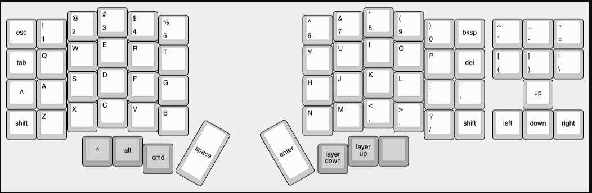
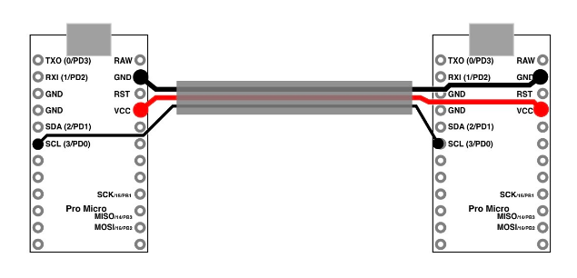
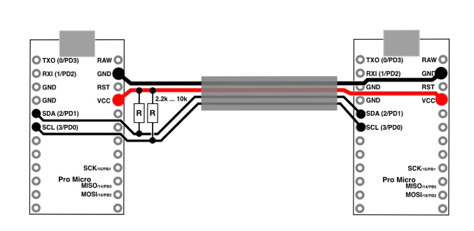
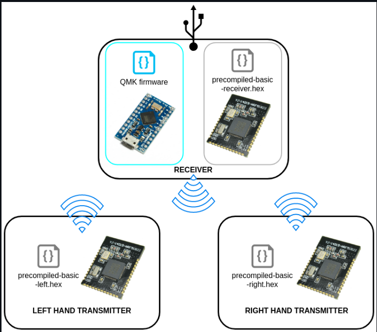
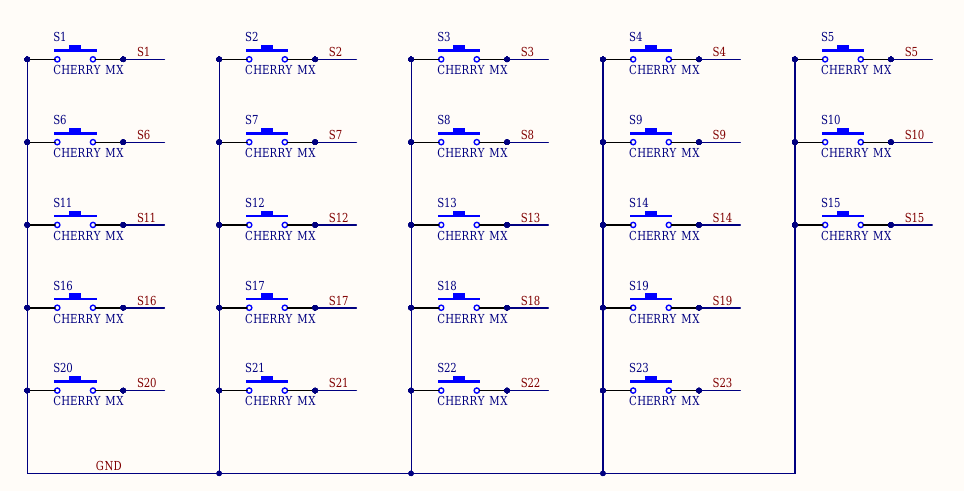
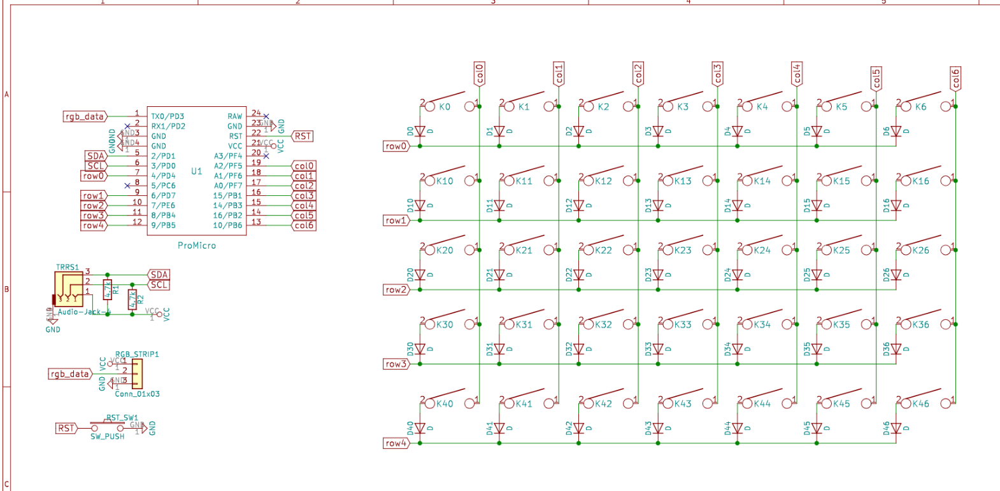
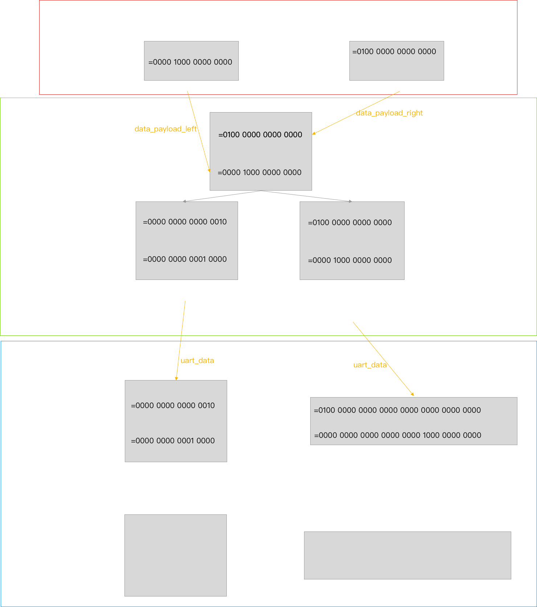

# qmk分体键盘指南
本来要发视频教程的，可惜老家的网速不够给力，索性写一个文字版本的教程。搞分体的主要目的是给一路上帮了我不少忙的章鱼哥搞一个无线分体，本着独乐乐不如众乐乐，顺便我也重新学习一下整个qmk键盘的设计思路为我自己正在开发的蓝牙固件提供更多想法，所以决定把有线和分体的教程都写一边。
首先说明一下，需要在会非分体有线qmk的基础下再进行本文的学习，关于qmk的基础学习可以看我的B站视频教程，不多重复。以下默认读者已经进行过相关学习。

## 有线分体（非本文重点，有线分体个人认为设计理念不对，所以未经过测试，也不会测试，请自行排错，懂哥，大佬请请喷）

### 按照文档进行传输协议配置（文档见qmk官方的feature_split_keyboard.md）
按照如下配列进行设置


**首先** 要明确一点，分体虽然是分开的，但是整体的键位矩阵是共用的，左右的keymap矩阵是写在一起的，进行键盘扫描的时候首先扫描秒左手边的键盘，然后扫描右手边的键盘，所以在keymaps.c中前几行都是左手键盘的，后面几行是右手键盘的。（PS：所以一般设置行数为左右2边行相加，列数为相同（其实是最大值，不够的一边可以填入伪引脚凑数或者干脆不填））

* 协议选择
  大佬的直接看文档进行高级配置即可，我这里选择最常见的传输协议：串口读写。（I2C自己看文档）

* 需要的硬件
  一个3芯的线（i2c需要4芯），可选的有trs/trrs音频线，或者sata线，或者自己搓等。共计需要2个线和相应的线头端子。在文档中提到arm系列的可能有些bug，所以建议使用avr系列，也是qmk玩家们用的最多的主控32U4，分体键盘，左右个需要一个。其他的硬件和正常32u4支持的qmk键盘一致。
线的连接方式如下（以Pro Micro为例子,可以连接的串口线为PD0/1/2/3，这里选择PD0为例子）

  

  i2c如下：

  

* 参数配置 （重点）

  1. 开启分体功能（rules.mk）：SPLIT_KEYBOARD = yes
  2. 设置左右手（由于默认qmk固件没有办法区分左右，共有4种方式)
  
    - 设置识别引脚（拉高为左，接地为右）（config.h）: #define SPLIT_HAND_PIN B7
  
    - 设置一个矩阵按键（接通为左）（config.h）: \#define SPLIT_HAND_MATRIX_GRID D0, F1
  
    - 写入EEPROM（推荐，在刷机的时候决定）（config.h）：\#define EE_HANDS
  
      - 刷入的时候决定是左还是右边，相应的刷机命令有：avrdude-split-left， avrdude-split-right;  dfu-split-left，dfu-split-right; dfu-util-split-left，dfu-util-split-right
    - 通过添加标志符定义（推荐，需要左右分别生成一个固件）（config.h）：\#define MASTER_RIGHT

  3. 设置行列，虽然可以左右完全对称设计，并且共用一套引脚参数，但是我还是建议分开配置，按照本文开始的提示部分，分别设置如下参数
  
        - #define MATRIX_ROWS 10 （左右行数之和）
        - #define MATRIX_COLS 9 （左右列数的最大值）
        - #define MATRIX_ROW_PINS { C5, C4, B6, B7, C7 } （左边行引脚）
        - #define MATRIX_ROW_PINS_RIGHT { D3, D2, D5, D6, B0 } （右边行引脚）
        - #define MATRIX_COL_PINS { C6, B4, B3, B2, B1, B0 } （左边列引脚）
        - #define MATRIX_COL_PINS_RIGHT { C7, B7, B6, B5, B4, B3, B2, C6, D4 } （右边列引脚）
  4. 接下来就是矩阵设置（键盘名字.h）:懂的都懂，不懂去看我的视频
```json
{ \ // 前面5行是左边的键盘
    { L00,   L01,   L02,   L03,   L04,   L05,   KC_NO, KC_NO, KC_NO }, \
    { L10,   L11,   L12,   L13,   L14,   L15,   KC_NO, KC_NO, KC_NO }, \
    { L20,   L21,   L22,   L23,   L24,   L25,   KC_NO, KC_NO, KC_NO }, \
    { L30,   L31,   L32,   L33,   L34,   L35,   KC_NO, KC_NO, KC_NO }, \
    { L40,   L41,   KC_NO, L43,   KC_NO, KC_NO, KC_NO, KC_NO, KC_NO }, \
    // 后面5行是右边的键盘
    { R00,   R01,   R02,   R03,   R04,   R05,   R06,   R07,   R08   }, \
    { R10,   R11,   R12,   R13,   R14,   R15,   R16,   R17,   KC_NO }, \
    { R20,   R21,   R22,   R23,   R24,   R25,   R26,   KC_NO, KC_NO }, \
    { R30,   R31,   R32,   R33,   R34,   R35,   R36,   KC_NO, KC_NO }, \
    { R40,   R41,   KC_NO, R43,   R44,   KC_NO, KC_NO, KC_NO, KC_NO }  \
}
```
  5. 最后就是keymaps.c文件的配置，和正常键盘一样，相信大家在理解上面的矩阵基础上是可以轻松完成的。
  6. 还有一些额外的高级配置例如灯光等，可以看文档解决，不在赘述。
## 无线分体（基于Redox Wirelsss，interphase和mitosis，正在测试中）
在阅读本章节前，首先确定已经读过以下3个代码库的文档和相关的代码：
https://github.com/YCF/mitosis-mod.git
https://github.com/Durburz/interphase-firmware.git
https://github.com/mattdibi/redox-w-firmware.git
没有读过或者看过上面3个库的代码文件，请不要继续阅读本文。

### 接收器的qmk端

无线分体的结构图如下：



相信懂得一下就懂了，这种方式在接收器上跑qmk，在2个分体键盘主体上跑nrf程序（大佬已经编译好，不过想改配列需需要重新编译，作为资深bug写作师，这一点搞定的），三者通过串口通信（2.4G信号）进行数据交换。其实可以看成4套系统：（1）32u4跑qmk和接收器的nrf芯片进行串口通信（2）接收器的nrf芯片和32u4进行串口通信，同时和每个键盘的nrf芯片进行2.4G通信（GZLL）（3）和（4）分体的2个键盘分别检测按键触发数据然后通过2.4G通信发送给接收器的nrf芯片数据。

接下来我们先从最简单的接受器开始谈起
**重点** 这部分大体上都和有线的一样，区别主要在于键盘的扫描程序不是用的qmk自定义的，而是大佬自己写的，以下代码对于理解无线分体极其重要请仔细阅读，包括我添加的注释，具体代码如下：

```c++
uint8_t matrix_scan(void)
{
    // 串口初始化（一般嵌入式设备编程首先要初始化外设信息）
    SERIAL_UART_INIT();
	// 设置过期时间，防止程序卡死。超过这个时间还没有收到数据就跳出接受键盘信息的循环。
    uint32_t timeout = 0;

    // 接收器每次能接受到的数据 初始化为's' = b01110011,理论上不如初始化为0，无所谓
    //the s character requests the RF slave to send the matrix
    SERIAL_UART_DATA = 's';
	
    // * 重点 - 1
    /**
    * 每一行利用一个固定2进制位的无符号数来表示，这样就通过一个数组可以表示一个矩阵了（即计算机中常用的技术手段，位运算）
    * 简单的举一个例子 比如有4行7列
    * 用一个8位的二进制数的数组表示，这个二进制数组为：matrix = [4,32,21,6]
    * 每个用2进制展开为
    * 列8位       | 7 6 5 4 3 2 1 0 |
    * -----------|-----------------|
    * 第0行 4  =  | 0 0 0 0 0 1 0 0 |
    * 第1行 32 =  | 0 0 1 0 0 0 0 0 |
    * 第2行 21 =  | 0 0 0 1 0 1 0 1 |
    * 第3行 6  =  | 0 0 0 0 0 1 1 0 |
    * 我们再来审视上面的数组，是不是非常像一个触发矩阵，1为触发的位置，0为矩阵没有触发的位置。
    * 这样我们就通过一个固定位数的数组表达了一个按键矩阵，具体要多少位由列决定，一般规定不超过32列。
    **/
    //trust the external keystates entirely, erase the last data
    // 通过上面的注释我们就了解到了下面这个数组的作用就是来表示按键矩阵的，所以有多少行就有多少个数据，一般为了防止溢出并且作为结束符，都会多加一个数据。举例有10行（分体为例子的话左边5行，右边5行），则写如下数组：
    uint8_t uart_data[11] = {0};
	
    // 每一个行（+10）都要接受一个字的数据，最后一个（+1）是结束符，共计11个字。
    //there are 11 bytes corresponding to 14 columns, and an end byte
    for (uint8_t i = 0; i < 11; i++) {
        // 等待数据发过来，每次等10秒没反应就跳出，可能信号不好，断了。
        //wait for the serial data, timeout if it's been too long
        //this only happened in testing with a loose wire, but does no
        //harm to leave it in here
        while(!SERIAL_UART_RXD_PRESENT){
            timeout++;
            if (timeout > 10000){
                break;
            }
        }
        // 把接受到的这一行的触发情况更新一下（用一个固定位的字表示）
        uart_data[i] = SERIAL_UART_DATA;
    }
	
    // 检查是否接受了正确的数据， 进行校验和纠错也是计算机程序设计，通信协议设计的一个重要原则。
    // 判断最低有效位（LSB）是否为预设好的值（这里为0xE0 = b11100000）
    //check for the end packet, the key state bytes use the LSBs, so 0xE0
    //will only show up here if the correct bytes were recieved
    if (uart_data[10] == 0xE0)
    {
        //shifting and transferring the keystates to the QMK matrix variable
        // * 重点 - 2
        /**
        * 根据接受到的数据，将其映射在qmk扫描的矩阵上（其实就是每一个分体键盘上的按键触发情况，把它转换成qmk的矩阵表示）
        * 在qmk中，矩阵的表示和刚刚重点1中提到的一样，也是用一个固定位的字表示一行
        **/
        for (uint8_t i = 0; i < MATRIX_ROWS; i++) {
            /**
            * 对于每一个接受到的行进行qmk矩阵映射，据一个例子：
            * 第3行 i = 2, 数据为21 = 0 0 0 1 0 1 0 1 
            * 写到这里才发现在redox wireless中qmk的键位一个整体的，不是按照左右叠加起来的，在redox wireless中，使用偶数行表示左边键盘，奇数行表示右边的键盘，所以有了如下的写法。（不过我建议还是叠加起来，因为如果这样写就要保证列数不能超过16列也就是2倍的列数不能超过32）
            * 这里我讲解redox wireless的写法
            * 对于i = 2, 对于的左边在接受到的数组中为第行2*i=4行，右边的为i*2+1=5行
            * 然后我们要把2行拼接起来，所以原来是用的8位的，现在就要用16位，同理16位就要扩展32位         
			* 对第4行（对应左边键盘，假设值为21）还有第5行（对应右边键盘，假设值为5）数据扩展 21 = 0000 0000 0001 0101， 5 = 0000 0000 0000 0101
            * 然后将右边的键盘键位和左边合并（先将右边的数据左移8位（一般这个左移的位数和矩阵有关，最小为左边键盘的列数），然后利用位运算操作'或'进行合并）
            *     5 << 8 = 0000 0000 0000 0101 << 8 
            *            = 0000 0101 0000 0000
            *      21    = 0000 0000 0001 0101
            * or   5<<8  = 0000 0101 0000 0000
            *      ans   = 0000 0101 0001 0101
            * 于是将计算得到的ans写入qmk的矩阵中，这里有一些细节上的问题需要读者有一定的经验并且稍加思考，比如我提到的使用2倍行如何实现，以及左移需要的位数要和本身的矩阵数要对应，一般应该为左边键盘的列数。
            *
            **/
            matrix[i] = (uint16_t) uart_data[i*2] | (uint16_t) uart_data[i*2+1] << 8;
        }
    }

	// 调用默认的矩阵扫描，处理一些关于灯光，via等操作
    matrix_scan_quantum();
    // 退出（异常？）
    return 1;
}
```

相信在有了本身qmk键盘固件编写的基础上，认真看了上面代码的注释就大概了解了redox wireless是如何工作的了，现在主要的任务就是定制串口发射程序（也就是2片键盘端的程序）。

最后配置USART（config.h）
```c++
//UART settings for communication with the RF microcontroller
#define SERIAL_UART_BAUD 1000000
#define SERIAL_UART_DATA UDR1
#define SERIAL_UART_UBRR (F_CPU / (16UL * SERIAL_UART_BAUD) - 1)
#define SERIAL_UART_TXD_READY (UCSR1A & _BV(UDRE1))
#define SERIAL_UART_RXD_PRESENT (UCSR1A & _BV(RXC1))
#define SERIAL_UART_INIT() do { \
    	/* baud rate */ \
    	UBRR1L = SERIAL_UART_UBRR; \
    	/* baud rate */ \
    	UBRR1H = SERIAL_UART_UBRR >> 8; \
    	/* enable TX and RX */ \
    	UCSR1B = _BV(TXEN1) | _BV(RXEN1); \
    	/* 8-bit data */ \
    	UCSR1C = _BV(UCSZ11) | _BV(UCSZ10); \
  	} while(0)
```

具体功能解释自己翻阅avr的串口usart通信教程，代码主要是在配置一些串口初始化的参数（建议直接抄）。

### 接受器的nrf端

这里用到了nrfSDK，硬核程度提高，请耐心看完，不懂多看几遍。。。笔者已经尽量简洁的进行了描述，可以抄的地方直接建议抄写。

首先配置main.c文件的串口引脚（建议抄）：

```c++
#define MAX_TEST_DATA_BYTES     (15U)                /**< max number of test bytes to be used for tx and rx. */
#define UART_TX_BUF_SIZE 256                         /**< UART TX buffer size. */
#define UART_RX_BUF_SIZE 1                           /**< UART RX buffer size. */


#define RX_PIN_NUMBER  25
#define TX_PIN_NUMBER  24
#define CTS_PIN_NUMBER 23
#define RTS_PIN_NUMBER 22
#define HWFC           false
```

开启一些和qmk主控通信的usart端口（建议抄）：

```c++
uint32_t err_code;
const app_uart_comm_params_t comm_params =
    {
        RX_PIN_NUMBER,
        TX_PIN_NUMBER,
        RTS_PIN_NUMBER,
        CTS_PIN_NUMBER,
        APP_UART_FLOW_CONTROL_DISABLED,
        false,
        UART_BAUDRATE_BAUDRATE_Baud1M
    };

APP_UART_FIFO_INIT(&comm_params,
                        UART_RX_BUF_SIZE,
                        UART_TX_BUF_SIZE,
                        uart_error_handle,
                        APP_IRQ_PRIORITY_LOW,
                        err_code);

APP_ERROR_CHECK(err_code);
```


对应刚刚提到的接受数据数组，nrf中这个数组定义如下（建议抄）：

```c++
// NRF_GZLL_CONST_MAX_PAYLOAD_LENGTH这个经过查阅为32
// Data and acknowledgement payloads
static uint8_t data_payload_left[NRF_GZLL_CONST_MAX_PAYLOAD_LENGTH];  ///< Placeholder for data payload received from host. 
static uint8_t data_payload_right[NRF_GZLL_CONST_MAX_PAYLOAD_LENGTH];  ///< Placeholder for data payload received from host. 
static uint8_t ack_payload[TX_PAYLOAD_LENGTH];                   ///< Payload to attach to ACK sent to device.
// 这里需要改成左右键盘行数的和大小，因为这个固件对于左右键盘数据的安排方式为，左键盘放在偶数位置，右键盘在奇数位置
static uint8_t data_buffer[10];
```

定义一些状态量方便调试和编程（建议抄）：
```c++
// 左手键盘是否开启
uint32_t left_active = 0;
// 右手键盘是否开启
uint32_t right_active = 0;
// 接收器从2个键盘的发射器收到的数据要存在这个临时的数据中
// 这个大小建议和列数保持同步，这里暂时用8位
uint8_t c;
```
开启数据接受队列，固定的一套流程，不多解释（建议抄）：
```c++
// Initialize Gazell
nrf_gzll_init(NRF_GZLL_MODE_HOST);

// Addressing
nrf_gzll_set_base_address_0(0x01020304);
nrf_gzll_set_base_address_1(0x05060708);

// Load data into TX queue
ack_payload[0] = 0x55;
nrf_gzll_add_packet_to_tx_fifo(0, data_payload_left, TX_PAYLOAD_LENGTH);
nrf_gzll_add_packet_to_tx_fifo(1, data_payload_left, TX_PAYLOAD_LENGTH);

// Enable Gazell to start sending over the air
nrf_gzll_enable();
```
**重点来了**
处理接受到的数据，请仔细阅读（不建议抄，在读懂的基础上改为自己的配列）：
```c++
// 主接受循环
while (true)
{
    // detecting received packet from interupt, and unpacking
    // 处理从左边键盘收到的数据
    // 这里假设左边键盘有5行，且被安排在将来发送数据的偶数行
    if (packet_received_left)
    {
        // 进行是否接受到信号的标志复位（计算机中常见做法，学过操作系统的进程同步应该会有体会（类似读写锁））
        packet_received_left = false;
        // 把从左边键盘收到的数据填入将来要发给qmk主控的数组
        // 数组的偶数行代表左键盘 data_0->L0 data_2->L1 data_4->L2 data_6->L3 data_8->L4
        data_buffer[0] =    ((data_payload_left[0] & 1<<3) ? 1:0) << 0  |
                            ((data_payload_left[0] & 1<<4) ? 1:0) << 1  |
                            ((data_payload_left[0] & 1<<5) ? 1:0) << 2  |
                            ((data_payload_left[0] & 1<<6) ? 1:0) << 3  |
                            ((data_payload_left[0] & 1<<7) ? 1:0) << 4; |
        // * 重点 以从左键盘的第1行（行数i=1,对应data_buffer的2*i=2这个位置）收到的数据为例子
        /**
        * 首先说明下面代码的大体功能是：顺序判断左边键盘的第1行的全部5列（0,1,2,3,4）是否是触发的，如果是就将这个一个位置的矩阵变为1
        * 然后选取第一行详细解释为：
        * ((data_payload_left[1] & 1<<6) ? 1:0) << 0 //功能：顺序判断左边键盘的第1行第0列是否是触发的，如果是就将这个一个位置的矩阵（即将来要发送给qmk主控的数组）变为1
        * 每个语句的解释为：(data_payload_left[1] & 1<<6) ： 判断左边发送的数据中第1个数字的第6个二进制位是否是1，这个data_payload_left具体每个数字的每一位表示的是哪一行哪一列需要和发送器的代码对于上，不是固定的。
        * 得到上面的左边键盘的开关情况，开为1关为0（即(data_payload_left[1] & 1<<6) ? 1:0) = 开1关0）
        * 对要发送给qmk主控处理的数据进行更新，即data_buffer更新，第2行的第0个位置进行矩阵开关设置
        * 使用左移动0位的方式，即开1<<0,关0<<0
        * 对于其他的4列（x << 1, x << 2, x << 3,x << 4）也做相同的判断
        * 最后使用'或'运算(|)组合成data_buffer[2]
        * 代表这我们从左键盘拿到实际的按键触发情况后，把它写入了将来要发送给qmk主控处理的数据矩阵中
        * 后面的几行也是一个道理
        **/
        data_buffer[2] =    ((data_payload_left[1] & 1<<6) ? 1:0) << 0  |
                            ((data_payload_left[1] & 1<<7) ? 1:0) << 1  |
                            ((data_payload_left[0] & 1<<0) ? 1:0) << 2  |
                            ((data_payload_left[0] & 1<<1) ? 1:0) << 3  |
                            ((data_payload_left[0] & 1<<2) ? 1:0) << 4; |

        data_buffer[4] =    ((data_payload_left[1] & 1<<1) ? 1:0) << 0 |
                            ((data_payload_left[1] & 1<<2) ? 1:0) << 1 |
                            ((data_payload_left[1] & 1<<3) ? 1:0) << 2 |
                            ((data_payload_left[1] & 1<<4) ? 1:0) << 3 |
                            ((data_payload_left[1] & 1<<5) ? 1:0) << 4;|

        data_buffer[6] = ((data_payload_left[2] & 1<<5) ? 1:0) << 1 |
                            ((data_payload_left[2] & 1<<6) ? 1:0) << 2 |
                            ((data_payload_left[2] & 1<<7) ? 1:0) << 3 |
                            ((data_payload_left[1] & 1<<0) ? 1:0) << 4;

        data_buffer[8] = ((data_payload_left[2] & 1<<1) ? 1:0) << 1 |
                            ((data_payload_left[2] & 1<<2) ? 1:0) << 2 |
                            ((data_payload_left[2] & 1<<3) ? 1:0) << 3 |
                            ((data_payload_left[2] & 1<<4) ? 1:0) << 4;
    }
	// 把从右边键盘收到的数据填入将来要发给qmk主控的数组, 大体操作和解释同上
    // 数组的奇数行代表左键盘 data_1->R0 data_3->R1 data_5->R2 data_7->R3 data_9->R4
    if (packet_received_right)
    {
        packet_received_right = false;
        
        data_buffer[1] = ((data_payload_right[0] & 1<<7) ? 1:0) << 0 |
                            ((data_payload_right[0] & 1<<6) ? 1:0) << 1 |
                            ((data_payload_right[0] & 1<<5) ? 1:0) << 2 |
                            ((data_payload_right[0] & 1<<4) ? 1:0) << 3 |
                            ((data_payload_right[0] & 1<<3) ? 1:0) << 4;

        data_buffer[3] = ((data_payload_right[0] & 1<<2) ? 1:0) << 0 |
                            ((data_payload_right[0] & 1<<1) ? 1:0) << 1 |
                            ((data_payload_right[0] & 1<<0) ? 1:0) << 2 |
                            ((data_payload_right[1] & 1<<7) ? 1:0) << 3 |
                            ((data_payload_right[1] & 1<<6) ? 1:0) << 4;

        data_buffer[5] = ((data_payload_right[1] & 1<<5) ? 1:0) << 0 |
                            ((data_payload_right[1] & 1<<4) ? 1:0) << 1 |
                            ((data_payload_right[1] & 1<<3) ? 1:0) << 2 |
                            ((data_payload_right[1] & 1<<2) ? 1:0) << 3 |
                            ((data_payload_right[1] & 1<<1) ? 1:0) << 4;

        data_buffer[7] = ((data_payload_right[1] & 1<<0) ? 1:0) << 0 |
                            ((data_payload_right[2] & 1<<7) ? 1:0) << 1 |
                            ((data_payload_right[2] & 1<<6) ? 1:0) << 2 |
                            ((data_payload_right[2] & 1<<5) ? 1:0) << 3;

        data_buffer[9] = ((data_payload_right[2] & 1<<4) ? 1:0) << 0 |
                            ((data_payload_right[2] & 1<<3) ? 1:0) << 1 |
                            ((data_payload_right[2] & 1<<2) ? 1:0) << 2 |
                            ((data_payload_right[2] & 1<<1) ? 1:0) << 3;
    }

    // checking for a poll request from QMK
    // 检测从qmk得到信息是否正确 uart（又叫usart）是双向的通信，所以nrf芯片也会从qmk主控获取到信息
    // 判断收到的串口数据是否合法，这里定义为's'，要和前面提到的qmk部分中的保持一致
    if (app_uart_get(&c) == NRF_SUCCESS && c == 's')
    {
        // sending data to QMK, and an end byte
        // 判断和qmk的主控连接成功后，这里要把所有刚刚处理好的左右键盘的矩阵数据发送给qmk主控
        // 这里一个共有10行=左右行数之和
        nrf_drv_uart_tx(data_buffer,10);
        // 最后发送一个结束字符，这里定义为'0xE0'，要和前面提到的qmk部分中的定义的保持一致
        app_uart_put(0xE0);

        // debugging help, for printing keystates to a serial console
        // 调试信息，不懂调试就算了，不是本文重点，会的老哥也不会看这个文章
        /*
        for (uint8_t i = 0; i < 10; i++)
        {
            app_uart_put(data_buffer[i]);
        }
        printf(BYTE_TO_BINARY_PATTERN " " \
                BYTE_TO_BINARY_PATTERN " " \
                BYTE_TO_BINARY_PATTERN " " \
                BYTE_TO_BINARY_PATTERN " " \
                BYTE_TO_BINARY_PATTERN " " \
                BYTE_TO_BINARY_PATTERN " " \
                BYTE_TO_BINARY_PATTERN " " \
                BYTE_TO_BINARY_PATTERN " " \
                BYTE_TO_BINARY_PATTERN " " \
                BYTE_TO_BINARY_PATTERN "\r\n", \
                BYTE_TO_BINARY(data_buffer[0]), \
                BYTE_TO_BINARY(data_buffer[1]), \
                BYTE_TO_BINARY(data_buffer[2]), \
                BYTE_TO_BINARY(data_buffer[3]), \
                BYTE_TO_BINARY(data_buffer[4]), \
                BYTE_TO_BINARY(data_buffer[5]), \
                BYTE_TO_BINARY(data_buffer[6]), \
                BYTE_TO_BINARY(data_buffer[7]), \
                BYTE_TO_BINARY(data_buffer[8]), \
                BYTE_TO_BINARY(data_buffer[9]));   
        nrf_delay_us(100);
        */
    }
    // allowing UART buffers to clear
    // 给一个发射和信息处理的延时，建议保持默认（抄！！！）
    nrf_delay_us(10);
    
    // if no packets recieved from keyboards in a few seconds, assume either
    // out of range, or sleeping due to no keys pressed, update keystates to off
    // 用来进行键盘矩阵的重置
    // 如果超过了INACTIVE次数的扫描还没发现有数据改动，就强制把矩阵刷新为全部未触发
    left_active++;
    right_active++;
    if (left_active > INACTIVE)
    {
        data_buffer[0] = 0;
        data_buffer[2] = 0;
        data_buffer[4] = 0;
        data_buffer[6] = 0;
        data_buffer[8] = 0;
        left_active = 0;
    }
    if (right_active > INACTIVE)
    {
        data_buffer[1] = 0;
        data_buffer[3] = 0;
        data_buffer[5] = 0;
        data_buffer[7] = 0;
        data_buffer[9] = 0;
        right_active = 0;
    }
}
```

看到这里其实接受器端的nrf代码应该已经可以完成了，不过其中爱思考的老哥们可能还有一些疑惑，例如right_active，left_active， packet_received_left，packet_received_right这几个变量是如何更新和初始化的，这里也给出相应的解释：
```c++
// 这是官方的回调函数，在每次接受到数据的时候会调用一次，建议看看就好，直接抄
// If a data packet was received, identify half, and throw flag
void nrf_gzll_host_rx_data_ready(uint32_t pipe, nrf_gzll_host_rx_info_t rx_info)
{   
    uint32_t data_payload_length = NRF_GZLL_CONST_MAX_PAYLOAD_LENGTH;
    
    if (pipe == 0)
    {	
        // 这里更新的左边键盘是否接受到数据的标志位
        packet_received_left = true;
        // 这里重置了左边键盘活动状态
        left_active = 0;
        // Pop packet and write first byte of the payload to the GPIO port.
        nrf_gzll_fetch_packet_from_rx_fifo(pipe, data_payload_left, &data_payload_length);
    }
    else if (pipe == 1) // 这边更新右边键盘的信息
    {
        packet_received_right = true;
        right_active = 0;
        // Pop packet and write first byte of the payload to the GPIO port.
        nrf_gzll_fetch_packet_from_rx_fifo(pipe, data_payload_right, &data_payload_length);
    }
    
    // not sure if required, I guess if enough packets are missed during blocking uart
    nrf_gzll_flush_rx_fifo(pipe);

    //load ACK payload into TX queue
    ack_payload[0] =  0x55;
    nrf_gzll_add_packet_to_tx_fifo(pipe, ack_payload, TX_PAYLOAD_LENGTH);
}
```

至此接收器的部分就完成了这也是这个指南中最难懂的一部分，可能坚持到这里已经有些蒙了，在本文的最后我会用一个图解来串联起来所有的矩阵转换，来帮读者理清思路。下面我们搞点轻松的键盘发生端代码解读。

### 发射器nrf端（就是分体的每一块键盘端）

首先是一些通用的初始化部分 (main.c) (建议抄)：

```c++
const nrf_drv_rtc_t rtc_maint = NRF_DRV_RTC_INSTANCE(0); /**< Declaring an instance of nrf_drv_rtc for RTC0. */
const nrf_drv_rtc_t rtc_deb = NRF_DRV_RTC_INSTANCE(1); /**< Declaring an instance of nrf_drv_rtc for RTC1. */


// Define payload length
#define TX_PAYLOAD_LENGTH 3 ///< 3 byte payload length when transmitting

// Data and acknowledgement payloads
static uint8_t data_payload[TX_PAYLOAD_LENGTH];                ///< Payload to send to Host. 
static uint8_t ack_payload[NRF_GZLL_CONST_MAX_PAYLOAD_LENGTH]; ///< Placeholder for received ACK payloads from Host.

// Debounce time (dependent on tick frequency)
#define DEBOUNCE 5 // 按键消抖时间
#define ACTIVITY 500

// Key buffers
static uint32_t keys, keys_snapshot;
static uint32_t debounce_ticks, activity_ticks;
static volatile bool debouncing = false; // 是否启用按键消抖

// Debug helper variables
static volatile bool init_ok, enable_ok, push_ok, pop_ok, tx_success;  

```

首先配置引脚nrf芯片的引脚(mitosis.h)（自定义，不建议抄）：
```c++
//首先定义左手键盘引脚，右手同理
#define L_LED 17

#define L_S01 2
#define L_S02 5
#define L_S03 8
#define L_S04 15
#define L_S05 14
#define L_S06 1
#define L_S07 4
#define L_S08 7
#define L_S09 10
#define L_S10 13
#define L_S11 0
#define L_S12 3
#define L_S13 6
#define L_S14 9
#define L_S15 19
#define L_S16 25
#define L_S17 29
#define L_S18 28
#define L_S19 30
#define L_S20 24
#define L_S21 23
#define L_S22 22
#define L_S23 21

// 配置左手引脚mask 形成了一个23引脚的状态表示
#define L_MASK (1<<L_S01 | \
 				1<<L_S02 | \
				1<<L_S03 | \
				1<<L_S04 | \
				1<<L_S05 | \
				1<<L_S06 | \
				1<<L_S07 | \
				1<<L_S08 | \
				1<<L_S09 | \
				1<<L_S10 | \
				1<<L_S11 | \
				1<<L_S12 | \
				1<<L_S13 | \
				1<<L_S14 | \
				1<<L_S15 | \
				1<<L_S16 | \
				1<<L_S17 | \
				1<<L_S18 | \
				1<<L_S19 | \
				1<<L_S20 | \
				1<<L_S21 | \
				1<<L_S22 | \
				1<<L_S23)
// 判断是不是要编译左手的固件（左右手的固件大部分是通用的，所以这里加上这个可以减少整体的工程量）
#ifdef COMPILE_LEFT
// 左右用管道0,右手管道1（理论上可以8个管道）
#define PIPE_NUMBER 0

#define LED_PIN L_LED

#define S01 L_S01
#define S02 L_S02
#define S03 L_S03
#define S04 L_S04
#define S05 L_S05
#define S06 L_S06
#define S07 L_S07
#define S08 L_S08
#define S09 L_S09
#define S10 L_S10
#define S11 L_S11
#define S12 L_S12
#define S13 L_S13
#define S14 L_S14
#define S15 L_S15
#define S16 L_S16
#define S17 L_S17
#define S18 L_S18
#define S19 L_S19
#define S20 L_S20
#define S21 L_S21
#define S22 L_S22
#define S23 L_S23

#define INPUT_MASK L_MASK

#endif
```

配置晶振（mitosis.h）（抄！！！，也可以用内部晶振，具体看模块，一般的模块直接抄就行）：

```c++
// Low frequency clock source to be used by the SoftDevice
#define NRF_CLOCK_LFCLKSRC      {.source        = NRF_CLOCK_LF_SRC_XTAL,            \
                                 .rc_ctiv       = 0,                                \
                                 .rc_temp_ctiv  = 0,                                \
                                 .xtal_accuracy = NRF_CLOCK_LF_XTAL_ACCURACY_20_PPM}
```
配置引脚功能为输入（直接抄）：
```c++
// Setup switch pins with pullups
static void gpio_config(void)
{
    nrf_gpio_cfg_sense_input(S01, NRF_GPIO_PIN_PULLUP, NRF_GPIO_PIN_SENSE_LOW);
    nrf_gpio_cfg_sense_input(S02, NRF_GPIO_PIN_PULLUP, NRF_GPIO_PIN_SENSE_LOW);
    nrf_gpio_cfg_sense_input(S03, NRF_GPIO_PIN_PULLUP, NRF_GPIO_PIN_SENSE_LOW);
    nrf_gpio_cfg_sense_input(S04, NRF_GPIO_PIN_PULLUP, NRF_GPIO_PIN_SENSE_LOW);
    nrf_gpio_cfg_sense_input(S05, NRF_GPIO_PIN_PULLUP, NRF_GPIO_PIN_SENSE_LOW);
    nrf_gpio_cfg_sense_input(S06, NRF_GPIO_PIN_PULLUP, NRF_GPIO_PIN_SENSE_LOW);
    nrf_gpio_cfg_sense_input(S07, NRF_GPIO_PIN_PULLUP, NRF_GPIO_PIN_SENSE_LOW);
    nrf_gpio_cfg_sense_input(S08, NRF_GPIO_PIN_PULLUP, NRF_GPIO_PIN_SENSE_LOW);
    nrf_gpio_cfg_sense_input(S09, NRF_GPIO_PIN_PULLUP, NRF_GPIO_PIN_SENSE_LOW);
    nrf_gpio_cfg_sense_input(S10, NRF_GPIO_PIN_PULLUP, NRF_GPIO_PIN_SENSE_LOW);
    nrf_gpio_cfg_sense_input(S11, NRF_GPIO_PIN_PULLUP, NRF_GPIO_PIN_SENSE_LOW);
    nrf_gpio_cfg_sense_input(S12, NRF_GPIO_PIN_PULLUP, NRF_GPIO_PIN_SENSE_LOW);
    nrf_gpio_cfg_sense_input(S13, NRF_GPIO_PIN_PULLUP, NRF_GPIO_PIN_SENSE_LOW);
    nrf_gpio_cfg_sense_input(S14, NRF_GPIO_PIN_PULLUP, NRF_GPIO_PIN_SENSE_LOW);
    nrf_gpio_cfg_sense_input(S15, NRF_GPIO_PIN_PULLUP, NRF_GPIO_PIN_SENSE_LOW);
    nrf_gpio_cfg_sense_input(S16, NRF_GPIO_PIN_PULLUP, NRF_GPIO_PIN_SENSE_LOW);
    nrf_gpio_cfg_sense_input(S17, NRF_GPIO_PIN_PULLUP, NRF_GPIO_PIN_SENSE_LOW);
    nrf_gpio_cfg_sense_input(S18, NRF_GPIO_PIN_PULLUP, NRF_GPIO_PIN_SENSE_LOW);
    nrf_gpio_cfg_sense_input(S19, NRF_GPIO_PIN_PULLUP, NRF_GPIO_PIN_SENSE_LOW);
    nrf_gpio_cfg_sense_input(S20, NRF_GPIO_PIN_PULLUP, NRF_GPIO_PIN_SENSE_LOW);
    nrf_gpio_cfg_sense_input(S21, NRF_GPIO_PIN_PULLUP, NRF_GPIO_PIN_SENSE_LOW);
    nrf_gpio_cfg_sense_input(S22, NRF_GPIO_PIN_PULLUP, NRF_GPIO_PIN_SENSE_LOW);
    nrf_gpio_cfg_sense_input(S23, NRF_GPIO_PIN_PULLUP, NRF_GPIO_PIN_SENSE_LOW);
}
```
读取引脚电平信息函数（抄）：
```c++
// Return the key states, masked with valid key pins
static uint32_t read_keys(void)
{
    return ~NRF_GPIO->IN & INPUT_MASK;
}
```
按键检测和去抖（抄）：
```c++
// 1000Hz debounce sampling
static void handler_debounce(nrf_drv_rtc_int_type_t int_type)
{
    // debouncing, waits until there have been no transitions in 5ms (assuming five 1ms ticks)
    if (debouncing)
    {
        // if debouncing, check if current keystates equal to the snapshot
        if (keys_snapshot == read_keys())
        {
            // DEBOUNCE ticks of stable sampling needed before sending data
            debounce_ticks++;
            if (debounce_ticks == DEBOUNCE)
            {
                keys = keys_snapshot;
                send_data();
            }
        }
        else
        {
            // if keys change, start period again
            debouncing = false;
        }
    }
    else
    {
        // if the keystate is different from the last data
        // sent to the receiver, start debouncing
        if (keys != read_keys())
        {
            keys_snapshot = read_keys();
            debouncing = true;
            debounce_ticks = 0;
        }
    }

    // looking for 500 ticks of no keys pressed, to go back to deep sleep
    if (read_keys() == 0)
    {
        activity_ticks++;
        if (activity_ticks > ACTIVITY)
        {
            nrf_drv_rtc_disable(&rtc_maint);
            nrf_drv_rtc_disable(&rtc_deb);
        }
    }
    else
    {
        activity_ticks = 0;
    }

}
```
到了这里keys里面已经存下了刚刚配置好的键盘引脚矩阵信息。

**重点来了**设置发送给接收器的键盘矩阵信息（自己定义）：
```c++
// Assemble packet and send to receiver
static void send_data(void)
{
	// 发送给接收器nrf芯片的数据
	// 每一行用一个32位数字表示，数字的每一位表示哪个列被触发了
	// 第0行为例子
    /**
    * 和刚刚接收器的规则要对应
    * ((keys & 1<<S01) ? 1:0) << 7的功能为
    * 当S01这个引脚为高电平（keys代表的值在对于的位上面为1），代表第7列被触发，后面同理
    **/
    data_payload[0] = ((keys & 1<<S01) ? 1:0) << 7 | \
                      ((keys & 1<<S02) ? 1:0) << 6 | \
                      ((keys & 1<<S03) ? 1:0) << 5 | \
                      ((keys & 1<<S04) ? 1:0) << 4 | \
                      ((keys & 1<<S05) ? 1:0) << 3 | \
                      ((keys & 1<<S06) ? 1:0) << 2 | \
                      ((keys & 1<<S07) ? 1:0) << 1 | \
                      ((keys & 1<<S08) ? 1:0) << 0;

    data_payload[1] = ((keys & 1<<S09) ? 1:0) << 7 | \
                      ((keys & 1<<S10) ? 1:0) << 6 | \
                      ((keys & 1<<S11) ? 1:0) << 5 | \
                      ((keys & 1<<S12) ? 1:0) << 4 | \
                      ((keys & 1<<S13) ? 1:0) << 3 | \
                      ((keys & 1<<S14) ? 1:0) << 2 | \
                      ((keys & 1<<S15) ? 1:0) << 1 | \
                      ((keys & 1<<S16) ? 1:0) << 0;

    data_payload[2] = ((keys & 1<<S17) ? 1:0) << 7 | \
                      ((keys & 1<<S18) ? 1:0) << 6 | \
                      ((keys & 1<<S19) ? 1:0) << 5 | \
                      ((keys & 1<<S20) ? 1:0) << 4 | \
                      ((keys & 1<<S21) ? 1:0) << 3 | \
                      ((keys & 1<<S22) ? 1:0) << 2 | \
                      ((keys & 1<<S23) ? 1:0) << 1 | \
                      0 << 0;

    nrf_gzll_add_packet_to_tx_fifo(PIPE_NUMBER, data_payload, TX_PAYLOAD_LENGTH);
}
```

至此一个完整的2.4G无线分体键盘就完成了，这几个矩阵的嵌套方式在本文最后有图解，不过这个的键盘端为一个引脚接一个按键，如下：



这样太过奢侈，所以有了redox wireless的改进版本，没错，还没有讲到redox wireless，因为我写到发射端才发现不一样，所有下面单独再说明一下redox wireless的键盘端

### Redox Wireless和interphase的改进键盘发射端

redox w改进了mitosis键盘的发射端，添加了rgb和矩阵连接的形式。

新的引脚初始化代码为：

```c++
// Setup switch pins with pullups
static void gpio_config(void)
{
	// 配置行为输入端（输入到芯片）
    // 并且定义当这个脚为高电平的时候，输入到芯片的值为1,否则为0
    nrf_gpio_cfg_sense_input(R01, NRF_GPIO_PIN_PULLDOWN, NRF_GPIO_PIN_SENSE_HIGH);
    nrf_gpio_cfg_sense_input(R02, NRF_GPIO_PIN_PULLDOWN, NRF_GPIO_PIN_SENSE_HIGH);
    nrf_gpio_cfg_sense_input(R03, NRF_GPIO_PIN_PULLDOWN, NRF_GPIO_PIN_SENSE_HIGH);
    nrf_gpio_cfg_sense_input(R04, NRF_GPIO_PIN_PULLDOWN, NRF_GPIO_PIN_SENSE_HIGH);
    nrf_gpio_cfg_sense_input(R05, NRF_GPIO_PIN_PULLDOWN, NRF_GPIO_PIN_SENSE_HIGH);
	// 配置列为输出端（从芯片输出电平）
	// 所以二极管的方向是从col到row
    nrf_gpio_cfg_output(C01);
    nrf_gpio_cfg_output(C02);
    nrf_gpio_cfg_output(C03);
    nrf_gpio_cfg_output(C04);
    nrf_gpio_cfg_output(C05);
    nrf_gpio_cfg_output(C06);
    nrf_gpio_cfg_output(C07);
}
```
同时引脚的定义和mask的定义也需要调整：
```c++
#define L_C01 6
#define L_C02 5
#define L_C03 4
#define L_C04 3
#define L_C05 2
#define L_C06 0
#define L_C07 30
#define L_R01 28
#define L_R02 23
#define L_R03 22
#define L_R04 21
#define L_R05 29
// mask只配置输入脚，将来要读取电平信息，不过可惜貌似没有用到后面
// 所以可以删掉，或者大佬后续用来优化检测速度使用
#define L_MASK (1<<L_C01 | \
 				1<<L_C02 | \
				1<<L_C03 | \
				1<<L_C04 | \
				1<<L_C05 | \
				1<<L_C06 | \
				1<<L_C07)
```
配置引脚的时候需要根据原理图来，即类似下面的原理图（图和代码可能不对应，请意会）：



这种写法要多定义一下行列数：
```c++
// 每个分体键盘本身的行列数
#define COLUMNS 7
#define ROWS 5
```
按键检测代码如下：
```c++
// Return the key states
// 需要根据自己的行数调整，keys_buffer里面存了一个固定位的数，表示这一行的触发状态，这个概念相信读到这里的玩家已经完全掌握了
static void read_keys(void)
{
	// 把每行的状态写入要发送给接受端的数组keys_buffer
    keys_buffer[0] = read_row(R01);
    keys_buffer[1] = read_row(R02);
    keys_buffer[2] = read_row(R03);
    keys_buffer[3] = read_row(R04);
    keys_buffer[4] = read_row(R05);
    return;
}
```
对于长时间不触发的按键强制清0
```c++
    if (empty_keys())
    {
        activity_ticks++;
        if (activity_ticks > ACTIVITY)
        {
        // 按照自己的行数添加 针对输出io
            nrf_drv_rtc_disable(&rtc_maint);
            nrf_drv_rtc_disable(&rtc_deb);
            nrf_gpio_pin_set(R01);
            nrf_gpio_pin_set(R02);
            nrf_gpio_pin_set(R03);
            nrf_gpio_pin_set(R04);
            nrf_gpio_pin_set(R05);
        }

    }
```
在芯片唤醒的时候进行清0
```c++
// This handler will be run after wakeup from system ON (GPIO wakeup)
void GPIOTE_IRQHandler(void)
{
    if(NRF_GPIOTE->EVENTS_PORT)
    {
        //clear wakeup event
        NRF_GPIOTE->EVENTS_PORT = 0;

        //enable rtc interupt triggers
        nrf_drv_rtc_enable(&rtc_maint);
        nrf_drv_rtc_enable(&rtc_deb);
		// 按照自己的行数添加 针对输出io
        nrf_gpio_pin_clear(R01); // 设置为低电平
        nrf_gpio_pin_clear(R02);
        nrf_gpio_pin_clear(R03);
        nrf_gpio_pin_clear(R04);
        nrf_gpio_pin_clear(R05);

        //TODO: proper interrupt handling to avoid fake interrupts because of matrix scanning
        //debouncing = false;
        //debounce_ticks = 0;
        activity_ticks = 0;
    }
}
```

其他的设置按照默认处理。
**重点**按键更新：
```c++
// Return the key states of one row
// 这个函数检测每一行
static uint8_t read_row(uint32_t row)
{
    uint8_t buff = 0;
    uint32_t input = 0;
    nrf_gpio_pin_set(row); // 把row行对应的引脚输出为高电平，然后检查每一列是不是为高（说明按下）或者为低（说明没有按下）
    // 根据刚刚的设置列引脚输入属性知道，高电平的时候为1,低电平为0
    input = NRF_GPIO->IN;  // 这里获取所有输入脚（即列）的电平状态
    // 然后开始逐列地检查是否按下
    /**
    * 这里还是用第一行举例子：
    * buff = (buff << 1) | ((input >> C01) & 1);
    * 这是检测第0列有没有被触发
    * buff表示已经检测完的列的状态
    * 因为是逐列检测所以这里直接左移空出一位（即当前列）开始修改
    * buff = b0, buff << 1 = b10 (二进制表示)
    * 后面的操作式为判断第1列引脚的状态也就是取出input的第C01位
    * 计算方式为把C01位挪到第0个位置然后和1做'与'运算，即((input >> C01) & 1)
    * 然后通过'或'运算把这一位的状态放入buff中
    * 后面的几列都是一个道理
    **/
    buff = (buff << 1) | ((input >> C01) & 1); // 第0列
    buff = (buff << 1) | ((input >> C02) & 1); // 第1列
    buff = (buff << 1) | ((input >> C03) & 1); // 第2列
    buff = (buff << 1) | ((input >> C04) & 1); // 。。
    buff = (buff << 1) | ((input >> C05) & 1); // 。。
    buff = (buff << 1) | ((input >> C06) & 1); // 。。
    buff = (buff << 1) | ((input >> C07) & 1); // 。。
    buff = (buff << 1); // 保证是一个8位数，如果列数超过8就是16位，最后要对齐齐到16位
    nrf_gpio_pin_clear(row); // 把row行对应的引脚复位输出为低电平
    return buff;
}
```

至此一个完整的无线分体方案，读者应该有了一定的眉目了。

具体要用到的编译工具和编译命令都在开头提到的几个仓库中可以找到，不在赘述。

最后我贴上自己理解的一个矩阵转换流程图，方便大家理清思路。




直到写完，才发现本文代码和说明中有一些小bug，请结合视频进行阅读（[B站视频教程](https://www.bilibili.com/video/BV1Ay4y1x7CJ/)），文中部分地方行列说明比较混乱，请仔细阅读，对由于本教程造成的个人经济，精力等一切直接和间接损失，概不负责。

对于所有使用本文教程进行的商业行为，请在与本文作者讨论并获得允许后进行，联系方式可以通过上方视频地址找到作者私信地址。